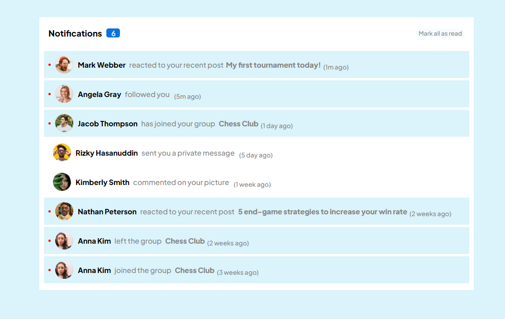

## Table of contents

- [Table of contents](#table-of-contents)
- [Overview](#overview)
  - [The challenge](#the-challenge)
  - [Screenshot](#screenshot)
  - [Links](#links)
- [My process](#my-process)
  - [Built with](#built-with)
- [Author](#author)
- [Acknowledgments](#acknowledgments)

## Overview

### The challenge

Users should be able to:

- Distinguish between "unread" and "read" notifications
- Select "Mark all as read" to toggle the visual state of the unread notifications and set the number of unread messages to zero
- View the optimal layout for the interface depending on their device's screen size
- See hover and focus states for all interactive elements on the page

### Screenshot

### Links

- Live Site URL: (https://deft-pastelito-90dc3d.netlify.app/)

## My process

### Built with

- Semantic HTML5 markup
- CSS custom properties
- Flexbox
- Javascript 
- React

### Continued development

I'm still not completely comfortable with react hooks useState, useEffects. I'll continue focusing on React for a while now.

## Author

- Website - [Aryan Agrahari](https://polite-pothos-50ebc7.netlify.app/)

## Acknowledgments

I would like to thank members of [BitByte] (https://github.com/BitByte-TPC) for helping me out whenever i got stuck on something.

